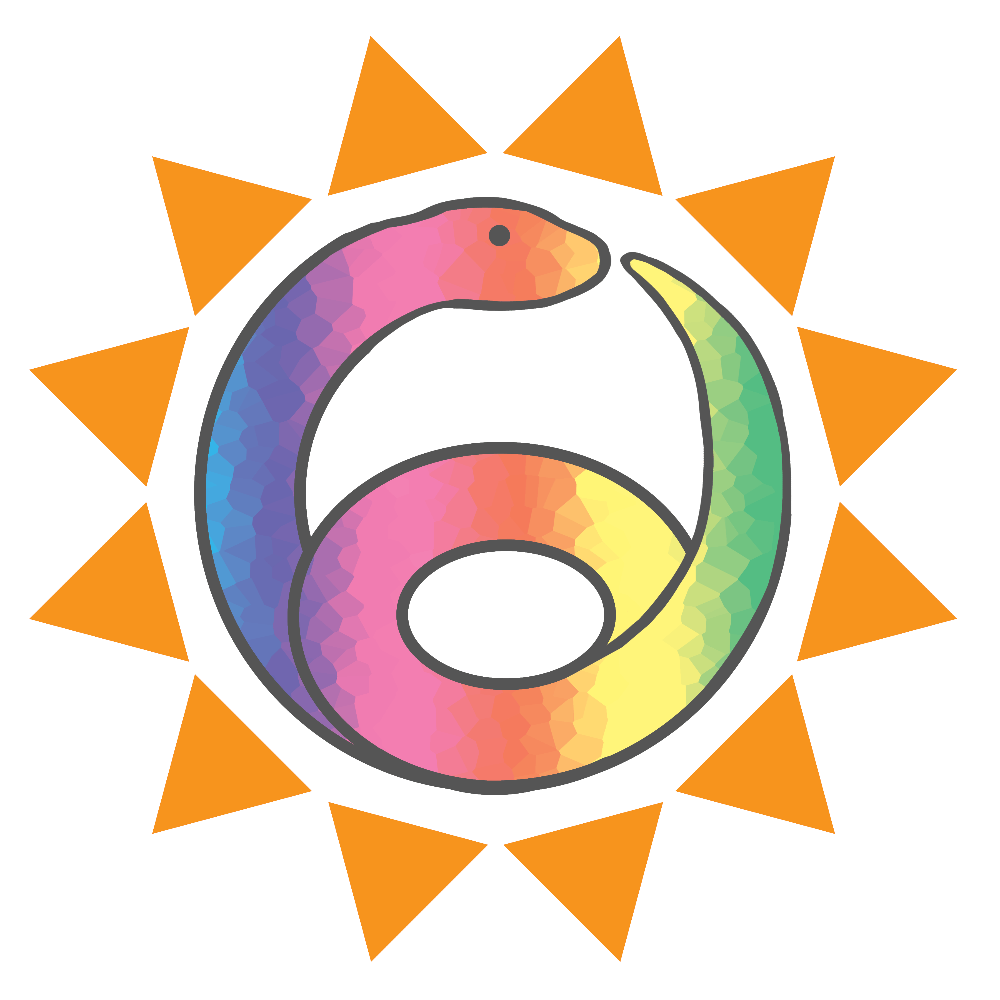

# Sunbeam: a robust, extensible metagenomic sequencing pipeline 

 

Sunbeam is a pipeline written in [snakemake](http://snakemake.readthedocs.io)
that simplifies and automates many of the steps in metagenomic sequencing
analysis. It uses [conda](http://conda.io) to manage dependencies, so it
doesn't have pre-existing dependencies or admin privileges, and can be deployed
on most Linux workstations and clusters.

Sunbeam currently automates the following tasks:

* Quality control, including adaptor trimming, host read removal, and quality
  filtering;
* Taxonomic assignment of reads to databases using [Kraken](https://github.com/DerrickWood/kraken);
* Assembly of reads into contigs using [Megahit](https://github.com/voutcn/megahit);
* Contig annotation using BLAST[n/p/x];
* Mapping of reads to target genomes; and
* ORF prediction using [Prodigal](https://github.com/hyattpd/Prodigal).

Sunbeam was designed to be modular and extensible. Some extensions include:

- [IGV](https://github.com/sunbeam-labs/sbx-igv) for viewing read alignments
- [KrakenHLL](https://github.com/zhaoc1/sbx_krakenhll), an alternate read classifier
- [Kaiju](https://github.com/sunbeam-labs/sbx-kaiju), a read classifier that uses BWA rather than kmers
- [Anvi'o](https://github.com/sunbeam-labs/sbx-anvio), a downstream analysis pipeline that does lots of stuff!

To get started, see our [documentation](http://sunbeam.readthedocs.io)!

------

### Changelog:

#### v1.2.0

 - Low-complexity reads are now removed by default rather than masked
 - Bug fixes related to single-end sequencing experiments
 - Documentation updates
 
#### v1.1.0

 - Reports include number of filtered reads per host, rather than in aggregate
 - Static binary dependency for [komplexity](https://github.com/eclarke/komplexity) for easier deployment
 - Remove max length filter for contigs
 
#### v1.0.0

 - First stable release!
 - Support for single-end sequencing experiments
 - Low-complexity read masking via [komplexity](https://github.com/eclarke/komplexity)
 - Support for extensions
 - Documentation on [ReadTheDocs.io](http://sunbeam.readthedocs.io)
 - Better assembler (megahit)
 - Better ORF finder (prodigal)
 - Can remove reads from any number of host/contaminant genomes
 - Semantic versioning checks
 - Integration tests and continuous deployment
